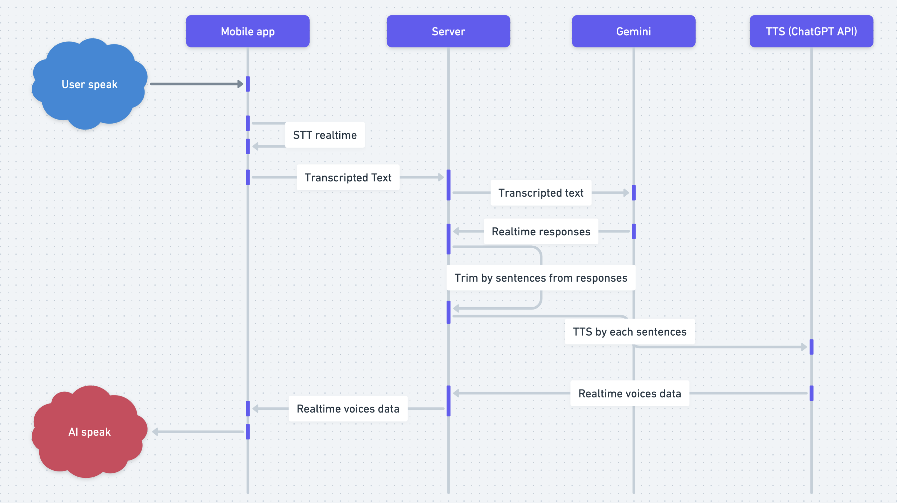

# AI Speaker Assistant app

## Description
This is a simple AI Speaker Assistant app building for compare the performance of different AI Speaker Assistant.

## Features
TBU

## Installation
TBU

## Usage
TBU

## License
TBU

## Progress

### 2024/03/02
- First try to use Deepgram API to transcribe the streaming microphone audio to text.
    - Youtube: https://www.youtube.com/watch?v=KA-kzRYfA9I
    - Tech stack:
        - STT: Deepgram
        - Mobile app: Flutter
        - Protocol: Websocket

### 2024/03/13
- Try to design of the AI Speaker Assistant app with 3rd party API.
    - 

### 2024/03/15
- Play aground with Gemini AI API.
    - [Gemini API](https://ai.google.dev/docs?_gl=1*1kk9k10*_up*MQ..&gclid=CjwKCAjw48-vBhBbEiwAzqrZVGvmGv6Srbo0VJ5An3y1IBB_Y8r6eZM5yt9ehCaLGewcBUOCyJAAhxoCybAQAvD_BwE)
    - [Youtube demo](https://www.youtube.com/watch?v=3NOhX47xV_M&t=42s)
    - Split stream text from Gemini API to sentences using Go Channels.
