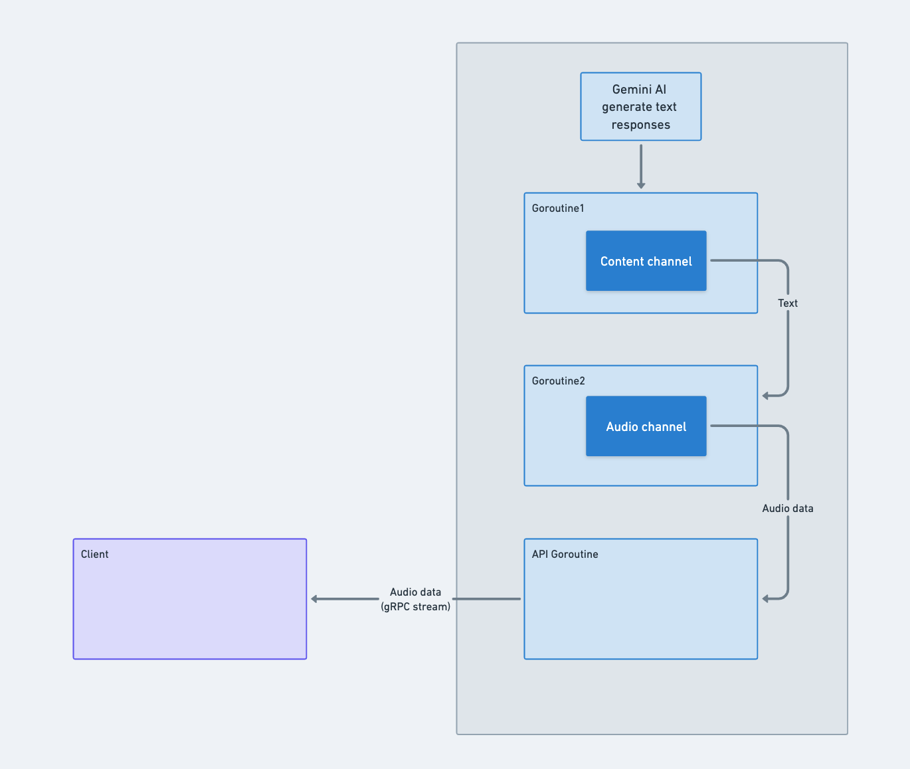

# AI Speaker Assistant app

## Description
This is a simple AI Speaker Assistant app building for compare the performance of different AI Speaker Assistant.

## Features
TBU

## Installation
TBU

## Usage
TBU

## License
TBU

## Progress

### 2024/03/02
- First try to use Deepgram API to transcribe the streaming microphone audio to text.
    - [Demo Ep1](https://www.youtube.com/watch?v=KA-kzRYfA9I)
    - Tech stack:
        - STT: Deepgram
        - Mobile app: Flutter
        - Protocol: Websocket

### 2024/03/13
- Try to design of the AI Speaker Assistant app with 3rd party API.
    - 

### 2024/03/15
- Play aground with Gemini AI API.
    - [Demo Ep2](https://www.youtube.com/watch?v=3NOhX47xV_M&t=42s)
    - [Gemini API](https://ai.google.dev/docs?_gl=1*1kk9k10*_up*MQ..&gclid=CjwKCAjw48-vBhBbEiwAzqrZVGvmGv6Srbo0VJ5An3y1IBB_Y8r6eZM5yt9ehCaLGewcBUOCyJAAhxoCybAQAvD_BwE)
    - Split stream text from Gemini API to sentences using Go Channels.

### 2024/03/17
- Trying with OpenAI TTS (text-to-speak) using terminal
    - [Demo Ep3](https://youtu.be/M7G_Ws1qgsM?si=hir2If0khgdCRvCf) - Demonstrate how to use OpenAI TTS API to convert text to speech using terminal.

### 2024/04/29: Voice chat with AI
- Implement the voice chat API
    - Tech stack:
        - AI engines: Gemini for realtime AI chat bot, Deepgram for STT, OpenAI for TTS
        - RPC framework: gRPC to communicate between Flutter app and Go server
        - Protocol: HTTP2
    - Limitations:
        - OpenAI: [Rate Limit](https://platform.openai.com/docs/guides/rate-limits/usage-tiers?context=tier-free)
        
    - [Demo Ep4](https://todo)
#### Development steps
1. **Setup gRPC**
    -  Server side: https://grpc.io/docs/languages/go/quickstart/
    -  Client side: https://grpc.io/docs/languages/dart/quickstart/
2. **Transform audio data & play streaming audio on client side**
    - Server:
        - Get the audio locally and send it to the client
    - Client:
        - Play the audio stream using `flutter_sound` package
3. **Implement API logic to handle the voice chat**
    - Server logic: 
